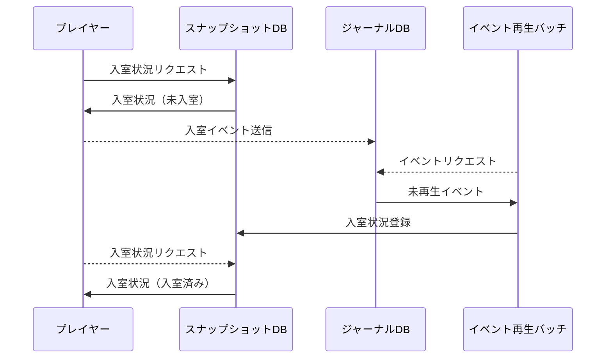

## 概要
Webで動く大富豪です。
現在の状況。
 - ラウンド開始からラウンド終了まで動作。
 - ジョーカー含みの組み合わせ未対応。
 - 前回ラウンド結果に応じたカード交換未対応。
 - 他、ローカルルール全般未対応。

## 開発向け
### イベントリプレイ
イベントソーシングを採用しているので、これをしないと入退室やゲーム処理が動かない。

```
env XDEBUG_SESSION=docker php artisan journal:replay
```

### イベント処理の流れ

例) 対戦部屋への入室

